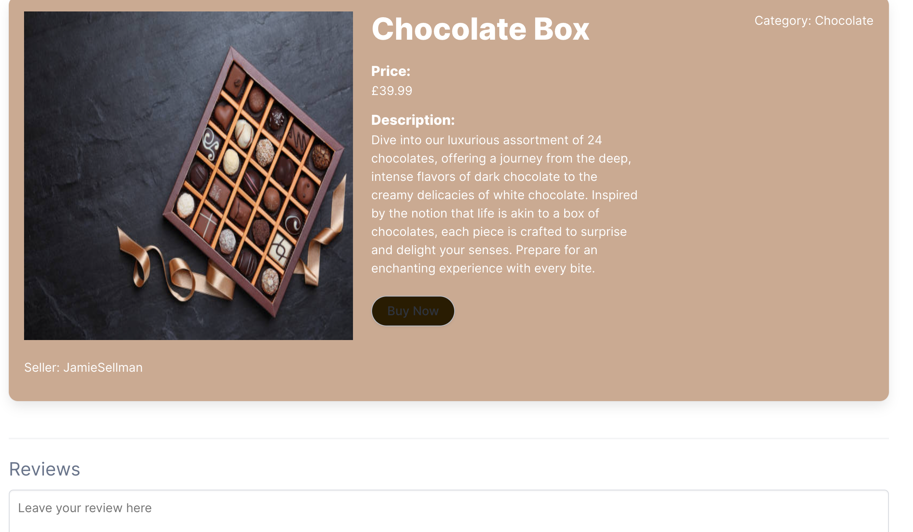
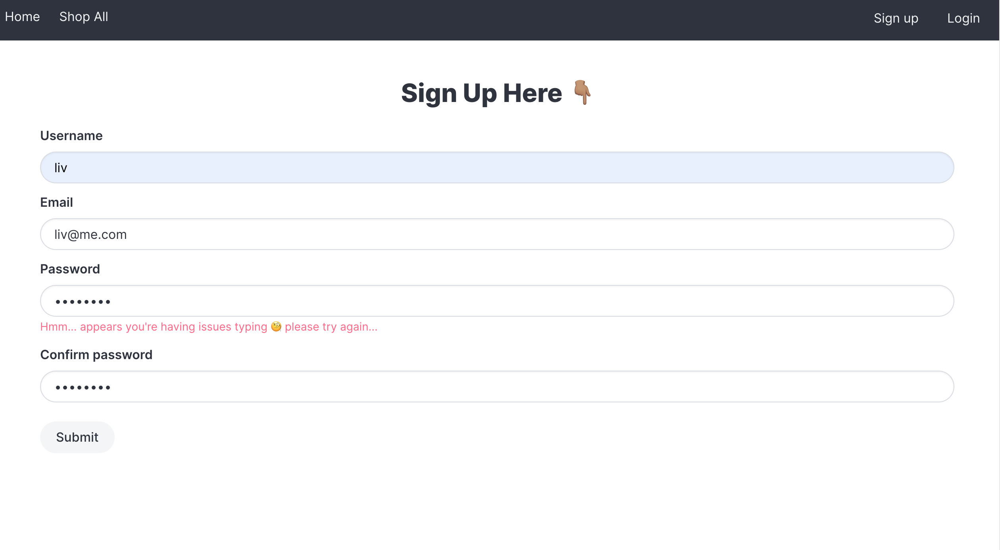
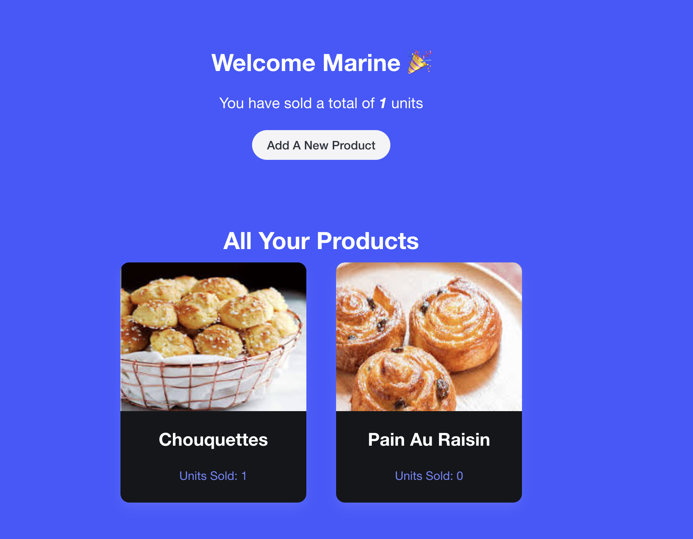
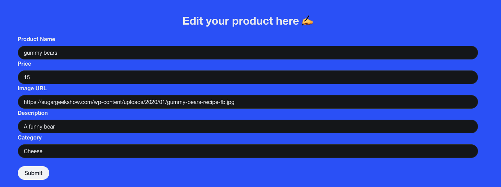

# Gourmet Voyage E-Shop

## Description

This project took place during week 8 of the General Assembly Software Engineering bootcamp.

This was a group project, and I worked alongside my peers [Jamie Sellman](https://github.com/jamessellman) and [Marine Crouzet](https://github.com/MarineCrou).

Gourmet Voyage is e-shop that allows shoppers to browse and purchase a range of delicious treats, and leave reviews. The site also has a seller area, where you can sign up, log in and create/edit/delete products for sale. Think of it as a food version of Etsy!

Check out GourmetVoyage [here](https://gourmet-e-shop-front.netlify.app/)!  
You can view the API [here](https://gourmet-e-shop.netlify.app/api/products)!

## Brief

We were given 1 week to build a full-stack application, fulfilling the following requirements:

- Use an Express API with mongoose to serve data from a Mongo database
- Consume our API with a separate front-end built with React
- Develop a complete product with CRUD functionality
- Deploy the app online

## Installation Instructions

To get started with this project locally, you will need Node.js and npm installed on the frontend. On the [backend](https://github.com/livdarby/project-3-backend), you will need Express, Mongoose and MongoDB.

Here are the steps to set up the project:

**Front-end:**

- Clone the front-end repository to your local machine using `git clone git@github.com:livdarby/project-3-frontend.git`.
- Navigate to the root of the project directory.
- Run `npm install` to install all dependencies.
- `npm run dev` to start the development server.

**Back-end:**

Ensure the following are installed:

- Node.js: Version 14 or higher recommended.
- npm: Usually comes with Node.js.
- MongoDB: Can be installed locally or configured to use a remote database.

Setup Instructions:

- Clone the repository using `git clone git@github.com:livdarby/project-3-backend.git`
- Navigate to the root of the project directory.
- `npm install`
- `npm run dev` to start the development server

Configure Environment Variables:

Create an .env file in the root directory of your project and add the following:

- PORT: The port number on which the server will listen (e.g., 3000).
- MONGO_URI: Your MongoDB connection string.
- JWT_SECRET: A secret key for JWT token generation and verification.

## Technologies Used

- Mongoose
- Express
- MongoDB
- ReactJS
- TypeScript
- Insomnia
- Axios
- SCSS/Bulma
- Bcrypt
- Express Mongo Sanitize
- JSON Web Token
- Mongoose Hidden / Unique Validator
- Express Validator
- Project management: Notion, Trello, Excalidraw
- Git & GitHub

## App Screenshots

Product List page with search bar and dropdown filtering capabilities →


Individual Product Page with details, seller, Buy Now button and reviews →


Sign Up Page with error handling →


Seller Homepage with total units sold and units sold by product →


Edit Product Page →


## Planning

We used Notion and Excalidraw for the planning, wireframing and pseudocoding stage of our project.

We highlighted a number of stretch goals, including the checkout and edit product pages, and made detailed notes on our MVP, Routes and user/product model schemas.

As we had the idea of displaying the units sold in the seller homepage view, we decided to add ‘unitsSold’ to the product and user models, even though we hadn’t quite figured out how we’d use it yet.

## Build/Code Process

**Day 1: Set Up Github Repos & Create The Project Backend**
<br>We pair programmed during the first day, taking it in turns to drive and navigate. Once we had finalised our project plan and finished wireframing, we set up two repos on GitHub - one for the frontend and one for the backend. We also set up three branches to push our solo code to.

We then began work on the backend together. This included creating the index.ts, seeding and models, the router and controllers.

We started with some basic routes, including getting all products, deleting/posting/putting products and setting up a secure route middleware for token authorization. We used the ```res.locals``` property to pass through the current user in the addAProduct route, to allow us to attach the user to the product object in the request/response cycle. We also added error handling and tested all routes in Insomnia.

You can find a couple of code examples below…

```
export async function addAProduct(req: Request, res: Response) {
    req.body.user = res.locals.currentUser;
    try {
        const addProduct = await Products.create(req.body);
        res.send(addProduct);
    } catch (e) {
        res.send({
        message: "unable to add product. Did you follow the correct format?",
        });
    }
}
```

```
export async function updateAProduct(req: Request, res: Response) {
    try {
        const productToUpdate: any = await Products.findById(req.params.\_id);
        if (!productToUpdate) {
        res.send({ message: "No product found" });
        }  
    if (res.locals.currentUser.\_id.equals(productToUpdate?.user)) {
        const update = req.body;
        const updatedProduct = await Products.findByIdAndUpdate(
        productToUpdate,
        update,
        {
        new: true,
        }
        );
        res.send(updatedProduct);
    } else {
        return res.send({
        message: "You are not authorized to update this product.",
        });
    }
} catch (e) {
    res.send({
    message: "product not found. Did you provide a valid productID?",
    });
    }
}
```

```
export default function secureRoute(
    req: Request,
    res: Response,
    next: NextFunction
    ) {
    
    const rawToken = req.headers.authorization;

    if (!rawToken) {
    return res.status(401).json({ message: "Unauthorized" });
    }

    const token = rawToken.replace("Bearer ", "");
    jwt.verify(token, SECRET, async (err, payload) => {
    if (err || !payload) {
    return res.status(401).json({ message: "Unauthorized" });
    }

    interface JWTPayload {
    userId: string;
    }

    const jwtPayload = payload as JWTPayload;
    const userId = jwtPayload.userId;
    const user = await Users.findById(userId);

    if (!user) return res.status(401).json({ message: "Unauthorized" });

    res.locals.currentUser = user;

    next();
    });
}
```

In the secureRoute, we used JSON Web Token to check if a user is authorised to proceed to the next route.

In the userModel, we used bcrypt to hash user passwords before storing them in our database.

```
usersSchema.pre("save", function hashPassword(next) {
this.password = bcrypt.hashSync(this.password, bcrypt.genSaltSync());
next();
});

export function validatePassword(
loginPlaintextPassword: string,
originalHashedPassword: string
) {
return bcrypt.compareSync(loginPlaintextPassword, originalHashedPassword);
}
```

**Day 2: Front-End Set Up**
<br>We set up our basic Router following the wireframe structure, which included the Navbar, Home Page, Product List Page, Log In and Sign Up Routes.

At this stage, we applied some basic styling using Bulma, SCSS.

Within the Product List Page, we fetched our data from the backend and mapped through the area, producing a ShowProduct component for each product.

```
React.useEffect(() => {
    async function fetchProducts() {
    const resp = await fetch(`${baseUrl}/products`);
    const data = await resp.json();
    console.log("fetch 1", data);
    setProducts(data);
    }
    fetchProducts();
}, []);
```

**Day 3: Solo Programming - Buy Product & Edit Product Pages** 
<br>We began the day with a productive stand-up and delegated tasks for individual programming sessions, using our Trello board.

I focused on developing the Checkout component, allowing visitors to progress from the product page to the purchase page, where they can input shipping and credit card details. I used useState to dynamically update delivery costs based on the chosen country from the drop-down list. I also enabled the ‘Complete Purchase’ button only when the Terms & Conditions checkbox is ticked. Once this is clicked, the unitsSold property is incremented in the backend for that product, and the UnitsSold for the seller is also incremented.

```
async function completePurchase() {
    const resp = await fetch(`${baseUrl}/products/${_id}`);
    const data = await resp.json();
    data.unitsSold++;
    const update = await axios.post(`${baseUrl}/unitsSold/${_id}`, {
    unitsSold: data.unitsSold,
    });
    setModalIsActive(true);
}
```

The completePurchase() function sets the modal display to true, which then gives renders a button to continue shopping and Link that redirects to the Product List Page.

For the edit product page, I used the useEffect hook to make a HTTP request to the server endpoint ```/products/${productId}```, retrieving the product data, and setting it in the formData state using setFormData.

The handleChange() Function is called whenever the user makes a change to any of the form fields. It updates the corresponding property in the formData state based on the input field's name attribute, using a structuredClone since the state update is immutable.

On submit, the handleSubmit() function is called, which sends a PUT request to the server to update the product information.

```
React.useEffect(() => {
    async function fetchProducts() {
    const resp = await fetch(`${baseUrl}/products/${productId}`);
    const productData = await resp.json();
    setFormData(productData);
    }
    fetchProducts();
}, []);
```

```
async function handleSubmit(e: SyntheticEvent) {
    e.preventDefault();
    const token = localStorage.getItem("token");
    const resp = await axios.put(`${baseUrl}/products/${productId}`, formData, {
    headers: { Authorization: `Bearer ${token}` },
    });
    navigate(`/product/${productId}`);
}
```

```
function handleChange(e: any) {
    const fieldName = e.currentTarget.name;
    const newFormData: any = structuredClone(formData);
    if (newFormData)
    newFormData[fieldName as keyof typeof formData] = e.target.value;
    setFormData(newFormData);
}
```

**Day 4: Posting & Displaying Reviews, Styling Updates**
<br>Today, we were able to work on some stretch goals! I was excited to have a go at displaying reviews on the individual product pages and adding functionality to let visitors leave a review.

To do this, I added a reviews key to the product model in the backend and a new route for posting reviews. This had to be separate to the Edit Product endpoint ```/products/${productId}```, since I didn’t want to replace the previous reviews each time a new one was posted.

When a request is received at the ```/reviews/${\_id}``` endpoint, the backend code extracts the productId from the request parameters ```req.params.\_id```. It then retrieves the product information from the database using the Products.findById(productId) method.

The backend code extracts the existing reviews for the product and combines them with the new reviews submitted in the request body. It also adds the current date and time to each new review before updating the list of reviews for the product.

The front-end code maps through the reviews array and renders them on the product page. The frontend code sends a PUT request to the ```/reviews/:\_id``` endpoint when a visitor submits a review, which updates the product's reviews accordingly.

```
export async function postAReview(req: Request, res: Response) {
    try {
        const productId = req.params.\_id;
        const productToUpdate: any = await Products.findById(productId);
        const existingReviews = productToUpdate.reviews;
        const today = new Date();
        req.body.reviews.map((review: any) => {
        return (review.date = today.toLocaleDateString());
        });
        req.body.reviews.map((review: any) => {
        return (review.time = today.toLocaleTimeString());
        });
        const newListOfReviews = [...req.body.reviews, ...existingReviews];
        req.body.reviews = newListOfReviews;
        const updatedProduct = await Products.findByIdAndUpdate(
        productToUpdate,
        req.body,
        {
        new: true,
        }
        );
        res.send(updatedProduct);
    } catch (e) {
        res.status(500).send({ message: "Error" });
    }
}
```

**Day 5: Deployment & Presentations**
<br> We used Netlify for deployment and presented our e-shop and code in the afternoon to the rest of the class. 

## Challenges
<br> 
As this was our first group project where we all worked on code independently, we faced challenges with Git version control and merge conflicts. We overcame this by resolving all our merge conflicts as a team to maintain code integrity and usability.

<br> We aimed to define our models at the beginning of the project, however we ended up adding a category filter to our product list page, which meant we had to retrospectively add the category property to our product model in the back-end. This had a knock-on effect to our seeding and controllers, so required some refactoring.

## Wins

A win for me was adding the review functionality, using the spread operator to add review posts to the existing array in the database, as this is not something we had covered in class.

Creating a route in the backend to increment the units sold for the product and user model was also a big win. 

## Key Learnings/Takeaways
- Brining the front and backend together for the first time in a full stack web application. 
- Consolidating ReactJS knowledge for the front-end and Mongoose and Express for the back-end.
- Refining classwork learnings and building on my knowledge base by implementing new features, such as posting reviews and putting unitsSold in the product and user models.
- Implementing daily standups to make our solo work efficient and constructive, whilst also communicating effectively as a team and coming together to support each other when needed.
- Becoming comfortable with version control, simulating a real-world working environment. 


## Bugs

When the handleClick() function is called in the Reviews component, the new review is successfully posted to the backend. However, it does not automatically render on the product page. To get around this we used ```window.location.reload()``` to envoke a page refresh, where the getReviews() function is called in the useEffect. This is a clunky workaround and I would like to find a smoother solution.


## Future Improvements
On the homepage, we have the three category buttons. We wanted these to redirect to the Product List page with the products automatically filtered by the category selected. We didn't manage to get this working within the project timeframe. 